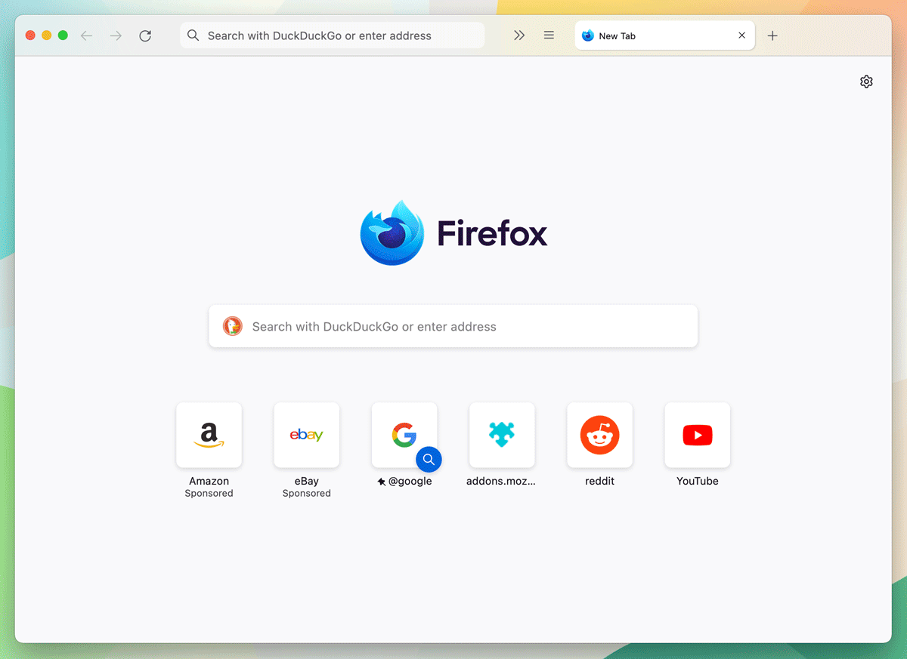

# Flow Theme for Firefox  

Considered tweaks to enhance the Firefox browsing experience 
whilst remaining true to the vanilla aesthetic.  

Designed with consideration for Vibrancy on Mac OS.  

Written from the ground up through references to Firefox source files at 
[searchfox.org](https://searchfox.org/). 
Written in `scss` and compiled using `webpack`.  

Tested on `Firefox 100.0`.  

### Note 
As of Firefox version `100`, 
the dark mode selector `-moz-lwtheme-brighttext` no longer works, seemingly 
replaced by `@media` query.  

--- 
## Install  

Symlink (recommended) or copy `./dist/userChrome.css` to 
`/path/to/firefox/profile/chrome`.  

--- 
## Build  

````shell
# build for production, emits userChrome.css in ./dist folder
npm run build-prod

# build for testing, emits userChrome.css in ./test folder
npm run build-dev
````

--- 
## Screens  

  

---
## License  
MIT.  
Johnson Zhou [johnson@simplyuseful.io](mailto://johnson@simplyuseful.io).